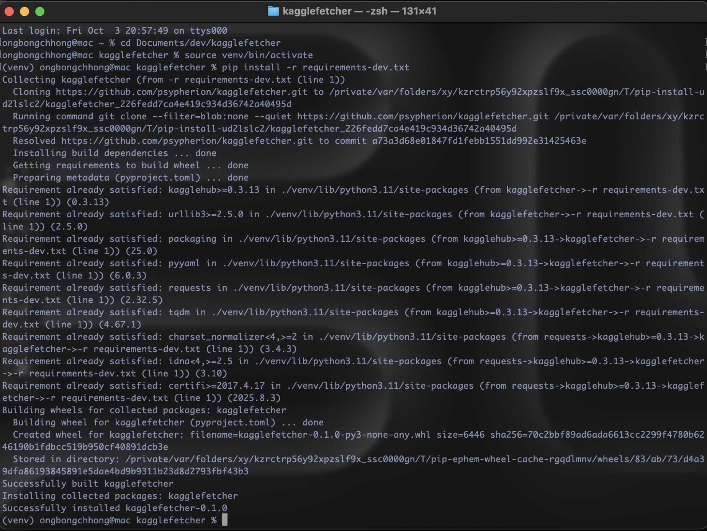
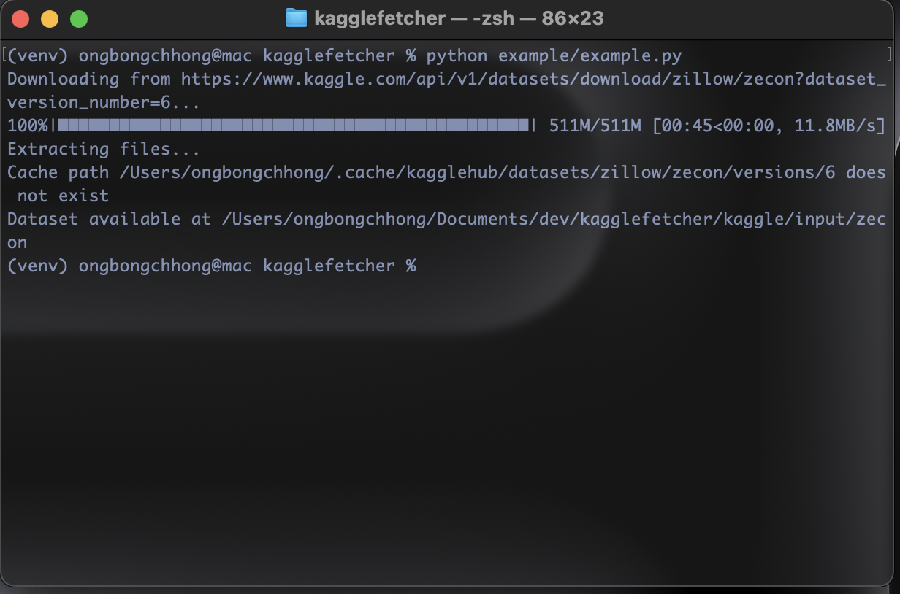

# kagglefetcher

A modern, flexible Python wrapper for [kagglehub](https://github.com/Kaggle/kagglehub):  
Easily download, move, and manage Kaggle datasets in any workflow.

---

## Features

- 🟢 Download datasets with a single call
- 📁 Move and organize downloads automatically
- 🗑 Clean up cache after relocation (optional)
- 📑 Pluggable logging for datasets and actions
- 🧰 Utility functions for directories, paths, and logging
- 🎯 Fully type-annotated, mypy-compatible code
- ✔️ Comprehensive test suite (`pytest`)

---

## Installation

Clone and install the package using pip:

```bash
pip install -e 'git+https://github.com/psypherion/kagglefetcher.git#egg=kagglefetcher'
```


---

## Usage

### Simple one-liner

```python
from kagglefetcher import fetch_dataset

path = fetch_dataset("username/dataset-name")
print(f"Dataset available at {path}")
```



### Full-featured workflow

```python
from kagglefetcher import KaggleFetcher

fetcher = KaggleFetcher(
    source="username/dataset-name",
    dest_base_dir="./my_data",
    enable_logging=True,
    log_dir="./my_logs"
)

# Stepwise operations
cache_path = fetcher.download()
final_path = fetcher.move(cache_path)
fetcher.cleanup(cache_path)

# Or do it all in one step
dest = fetcher.fetch(keep_cache=False)
```

---

## Utilities

`kaggle_fetcher.utils` contains:

- `ensure_dir(path)` — safely create directories
- `clean_path(path)` — normalized, expanded paths
- `setup_logger(log_dir, log_file, module_name)` — flexible logger setup

---

## Type Checking

Use [mypy](https://mypy-lang.org/) for static type checking:

```bash
pip install mypy
mypy kagglefetcher
```

---

## Testing

Tests use pytest and mock out network calls for fast, safe runs.

```bash
pip install pytest
pytest
```

---

## Contributing

- Format with `black`
- Type annotate functions
- Ensure all tests and type checks pass before submitting a PR

---

## License

MIT. See [LICENSE](LICENSE).

---

## Author

psypherion  
sayan84c@gmail.com  
